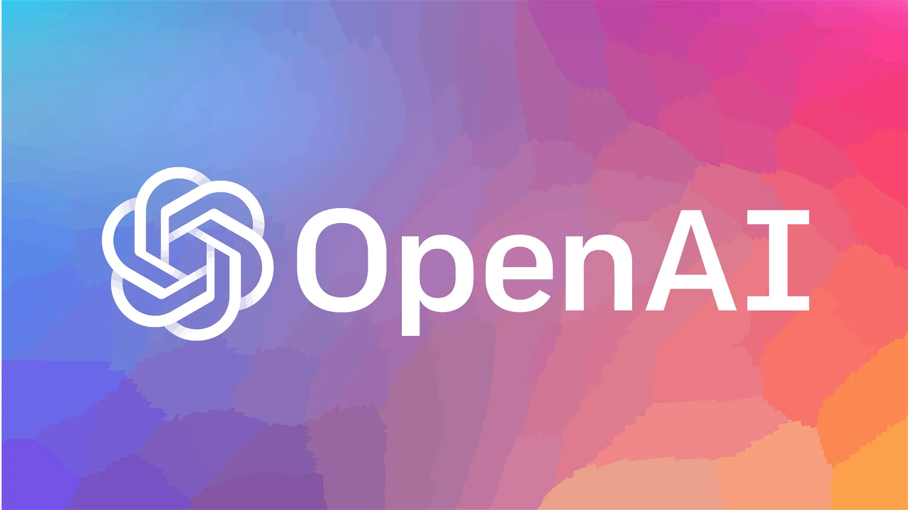
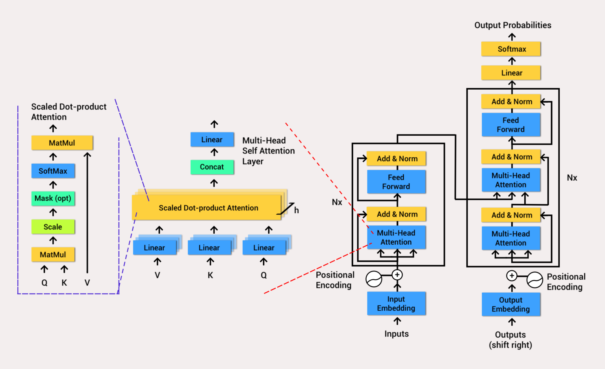
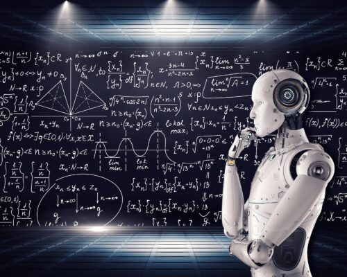

# What is Open AI Chat GPT? Know Full Details 2023

Last Updated on: January 22, 2023 

10 mins read 

<!--  -->
</img>

There has been a lot of talk about Chat GPT  since its launch in November 2022. This **‘smart chat’** has surprised everyone. In this post we will discuss everything you need to know and how you can use Chat GPT efficiently 

In this article we will discuss :-

* [What is Open AI Chat GPT ?](#intro)
* [Where you can use Chat GPT ?](#uses)
* [History of Chat GPT ?](#history)
* [How Chat GPT works ?](www.google.com)
* [How chat GPT utilizes adv. AI to create revolutionary model ?](www.google.com)
* [Merits & Demerits of Chat GPT ?](www.google.com)
* [Are Software Engineers is in Danger ?](www.google.com)
* [Frequently Asked Questions]()
* [Conclusion]()

## What is  Chat GPT 

**Chat GPT** is defined as a **Generative Pre-training Transformer**. However in practice it is understood as an *artificial intelligence chat* that has been trained and designed to hold natural conversations. Chat GPT belongs to the research company **OpenAI**, founded in San Francisco in 2015 by *_Sam Altman, Elon Musk, Greg Brockman, Ilya Sutskever and Wojciech Zaremba._*

    1. It's an autoregressive language model based on the 'transformer' architecture and uses **deep learning** to produce human-like text. It's used to measure a chatbot's ability to understand and respond accurately to customer inquiries.

    2. ChatGPT uses a combination of **natural language processing, machine learning, and graph theory** to simulate automated *customer service chat.* Its training data includes manual pages, information about Internet phenomena, and programming languages such as bulletin board systems and Python.

    3. Using ChatGPT, it's possible to generate news summaries, product descriptions, stories, solutions for problems, and answers to questions. To use ChatGPT, one must create an account on the OpenAI website and generate a new API key.

## What is Chat GPT used for?
 
✅ With GPT you can generate coherent and well-written texts in a wide range of *styles, topics and languages.* In addition, news summaries, product descriptions or stories can be generated.

	
✅ It can be used to generate attractive **posts** and **messages** for social networks.

✅ With GPT you can **generate reports**, e-mails and other content for productivity applications.

✅  Thanks to this chat, problems can be *analyzed and solutions* or answers to questions can be generated.

✅ Special Thanks to chat GPT, now large data sets can be analyzed and valuable information can be extracted from them.

✅ Can understand and generate more diverse forms of text, such as images, audio, and video.

## History of Open AI Chat GPT 
|   |   |
|--------------|-----------|
| Name of Organisation | Open AI |
| Category     | Tech Infromation  |  
| Article      |  Everything you need to know about OpenAI   | 
| Founder      |  Elon Musk, Sam Altman, Greg Brockman, Ilya Sutskever, Wojciech Zaremba  | 
| Founded     |  2015   |
|  Introduced    | 	Chat GPT-1 – 2018 Chat GPT-2 – 2019 Chat GPT-3 – 2020  Chat GPT3X – 2022 |
| Country | United State |
| Official Website | https://openai.com/ |

OpenAI Chat GPT is the evolution of the GPT (Generative Pre-training Transformer) language model, which was first introduced in 2018 by OpenAI. It was trained on a massive amount of internet text data and was capable of generating human-like text. This model was fine-tuned for a variety of natural languages processing tasks such as language translation, text summarization, and question answering.

In 2019, OpenAI released GPT-2, an improved version of GPT, which was trained on even more data and was able to generate even more human-like text. GPT-2 was able to generate coherent, fluent paragraphs of text on a variety of topics.

In 2020, OpenAI released GPT-3, the latest version of GPT. GPT-3 is trained on an even larger amount of data and has the ability to perform a wide range of natural language processing tasks without any fine-tuning. It is capable of answering questions, summarizing text, and even writing coherent and fluent paragraphs on any topic. This makes GPT-3 one of the most powerful natural language processing models ever created.

The latest version of GPT-3 is OpenAI GPT-3X, it’s trained on even larger dataset, and has the ability to perform a wide range of natural language processing tasks with more accuracy and fluency.

## How Chat GPT Works ?

The GPT-3 model is a type of artificial intelligence (AI) called a neural network designed to simulate how the human brain processes information. It has 175 billion parameters, making it the largest language model ever trained.

To work, GPT needs to be "trained" on a large amount of text. For example, the GPT-3 model was trained on a text set that included over 8 million documents and over 10 billion words.

From this text, the model learns to perform  **natural language processing tasks**  and generate coherent, *well-written text*. Once the model is well trained, GPT can be used to perform a wide range of tasks, as we have seen in the previous section. Reinforcement learning, based on **human feedback**, was used for training.

### But how did they create the reward model for reinforcement learning?

Ultimately, by supervised fine tuning. The human AI trainers provided conversations in which they represented both the **user** and the **AI assistant**.

In addition, the coaches were provided with written suggestions to help them write their proposals. So, they mixed this new dataset with the **InstructGPT dataset** that was transformed into a dialog format.

In order to collect the data, they took some conversations that the trainers had had with Chat GPT and randomly selected them. In this way they tested various endings for the coaches to rank.

For this reason, these reward models could be adjusted using Proximal Policy Optimization. Also, the trainings were carried out on a **Microsoft Azure platform** on a **supercomputer**. 

In conclusion, to use GPT in a chat, the model is provided with an input in the form of text. This input can be in the form of a question or a context sentence. And, from this input, GPT generates an appropriate and coherent response. In fact, this response can be used in a chatbot or any other application where it is necessary to generate a text from a given input

# How Chat GPT utilizes the advancements in Artificial Intelligence to create a revolutionary language model

## The Transformer Architecture: 

* A **“transformation”** is a type of data processing that is performed on a *sequence of elements*, such as words in a sentence or characters in a word. And “transformers” are **machine learning models** that are specifically designed to process sequences of elements using transformations.

</img>

* One of the key advances in AI that Chat GPT uses is the use of **transformer architecture**. This is a type of neural network that was introduced by **Vaswani et al**. in their 2017 paper **“Attention is All You Need.”**

* The transformer architecture is particularly well-suited to natural language processing tasks, such as language translation and text generation, due to its ability to efficiently process long sequences of data. 

* The transformer architecture consists of self-attention layers, which allow the model to weigh the importance of different words or phrases in each input. This allows the model to better understand the context and meaning of the input, and to generate more coherent and coherent responses. 

* In addition to self-attention layers, the transformer architecture also includes feed-forward layers and residual connections. These components allow the model to learn more complex patterns in the data and to better capture the relationships between different words or phrases. 

## Large-Scale Pre-Training: 

</img>

Another key advantage of Chat GPT is its ability to learn from large amounts of data. It is pre-trained on a massive dataset of text, which allows it to understand the patterns and structure of natural language. This pre-training allows Chat GPT to generate responses that are more human-like and less robotic. 

## Adaptability to Different Contexts and Situations: 

Another advantage of Chat GPT is its ability to adapt to different contexts and situations. It can understand the context of a conversation and generate appropriate responses based on that context. This allows it to have more natural and varied conversations with users.

## Benefits and Limitations 

I hope you have previously read  [this](#uses)

Now lets see some limitations: 

## Limitations 
* It requires a lot of computational resources to train the model and make predictions.
* It can generate biased or offensive text if the model is trained on biased data.
* It may not always generate text that is contextually accurate, as the model is not able to fully understand the context of the input it receives.
* It can be challenging to fine-tune the model for specific tasks and use cases, as it requires a significant amount of expertise in natural language processing and machine learning.

]

## Are software Engineers are in danger 

**No** According to me and recent studies. Chat GPT cannot replace humans specially **Software engineers** because all these things were build and trained by **humans only**

Though it has been trained over very large dataset but it cannot able to understand the thought process of modern human

In few couple of years may be engineers will develop something new which will even replace Chat GPT.

ChatGPT is an amazing tool for rapid application development, but it will not replace programmers. While it can help reduce some of the workload of developers, they are still needed to ensure accuracy, consistency, and quality.

Moreover Software Engineers are such person which are very diverse and versatile they learn new technologies very easily and able to adapt new things quickly.

But who know the future so study well 😁

 

## Frequently Asked Questions 

### 1. Is ChatGPT free?

The cost of running ChatGPT is estimated to be around $100,000 per day. This is because it is hosted on Microsoft’s Azure cloud, so OpenAI doesn’t need to buy a physical server room. Microsoft charges $3 an hour for a single A100 GPU, and each word generated on ChatGPT costs $0.0003. This means that a single response from ChatGPT will cost at least 1 cent to the company.

It's important to note, though, that ChatGPT is currently free to use, but OpenAI is reportedly exploring ways to monetize the popular chatbot. This means that in the future, users may have to pay to access the service. For now, though, you can use ChatGPT for free.

## 2. Is ChatGPT open source?
Chat GPT-3 is not an entirely open source platform however, OpenAI has released the source code for their GPT-3 family of language models.

The source code, which was released to the public in 2020, can be used to build and modify language processing systems. Additionally, there are several open source alternatives to ChatGPT available on the market. Examples include GPT-J and GPT-NeoX, two open source AI models created by a collective of researchers called EleutherAI in 2021 and 2022 respectively. GPT-J has 6 billions parameters, and GPT-NeoX 20B has 20 billions parameters.

Furthermore, Microsoft is reportedly planning to update its Bing search engine to include artificial intelligence from OpenAI’s ChatGPT chatbot. This suggests that OpenAI's ChatGPT technology may become more open source in the near future.

### 3. How to use ChatGPT?
ChatGPT is a powerful, state-of-the-art language processing AI model developed by OpenAI. It is used for many applications such as translation, language modelling, and text generation for chatbots. To use ChatGPT, users must first create an account on the OpenAI website.

Once the user has logged in, they can start using the chatbot by typing their text into the chat box. The chatbot will use its natural language processing to generate a response based on the input. ChatGPT is capable of answering follow-up questions, challenging incorrect premises, rejecting inappropriate queries and even admitting its mistakes. It is also able to understand context and generate appropriate responses.

### 4. Can ChatGPT replace Google?

At present, ChatGPT cannot completely replace Google. Google has been the reigning king for over two decades and is still evolving. That said, ChatGPT has shown that it can pose a real threat to the supremacy of Google in the coming future. As for now, ChatGPT is simply an alternative to ads-ridden text-based searches.

## Conclusion 

In conclusion, ChatGPT is an impressive AI-driven tool that offers excellent potential for businesses and organizations. Its capabilities include generating texts in various languages, producing summaries and stories, and delivering consistent answers.

Additionally, it can also be used to optimize website metadata, generate programming code, and facilitate seamless, multi-channel communications to improve customer experience.

Although ChatGPT has its limits, it is still a powerful and useful tool that can help businesses and organizations create better customer experiences and improve their operations.

